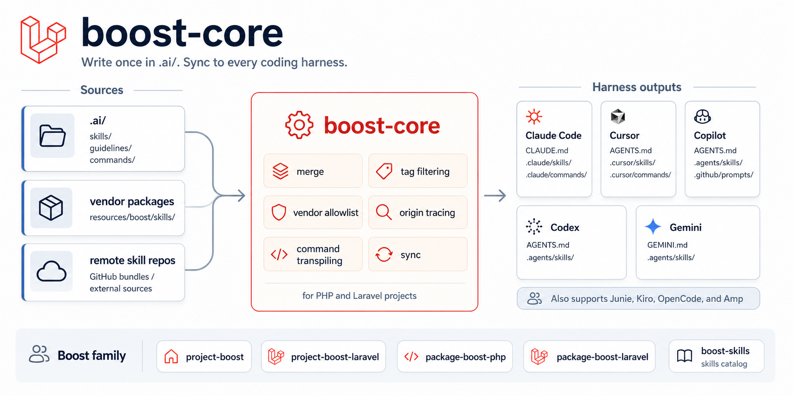
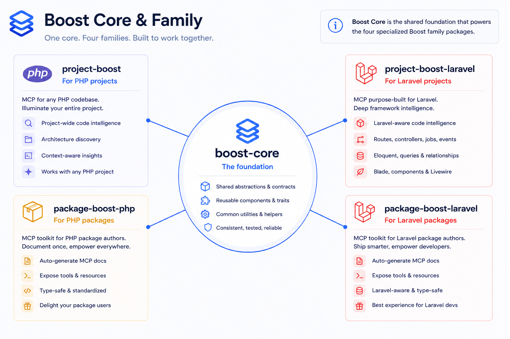

# boost-core

[](https://packagist.org/packages/sandermuller/boost-core)
[](https://github.com/sandermuller/boost-core/actions/workflows/run-tests.yml)
[](https://packagist.org/packages/sandermuller/boost-core)
[](LICENSE)
[](https://github.com/laravel/boost)

> AI agent configuration sync for any PHP project. Write skills, guidelines, and commands once in `.ai/`; boost-core publishes them to nine agents (Claude Code, Cursor, Copilot, Codex, Gemini, Junie, Kiro, OpenCode, Amp). No framework dependency.



Tag filtering, remote skill sources, vendor allowlist, `boost doctor`, `boost where` origin tracing, and `.ai/commands/` argument-transpiling fanout. Coexists with [`laravel/boost`](https://github.com/laravel/boost) in Laravel projects via [`sandermuller/project-boost-laravel`](https://github.com/sandermuller/project-boost-laravel).



## Install

`boost-core` is the engine. You rarely install it directly — you install the family package that matches what you're building, and it pulls `boost-core` in.

| You're building                              | Install                                                                                       | Ships                                                                                      |
|----------------------------------------------|-----------------------------------------------------------------------------------------------|--------------------------------------------------------------------------------------------|
| A PHP application (not a package)            | [`sandermuller/project-boost`](https://github.com/sandermuller/project-boost)                 | App-dev skills — DDD layering, repository pattern, DI, domain modeling, legacy coexistence |
| A Laravel application                        | [`sandermuller/project-boost-laravel`](https://github.com/sandermuller/project-boost-laravel) | `laravel/boost` MCP coexistence + nine-agent fanout + tag filter + remote skills           |
| A framework-agnostic Composer package        | [`sandermuller/package-boost-php`](https://github.com/sandermuller/package-boost-php)         | Package-author skills + `lean` / `gitattributes` commands                                  |
| A Laravel package                            | [`sandermuller/package-boost-laravel`](https://github.com/sandermuller/package-boost-laravel) | Laravel-package skills + `McpJsonEmitter`                                                  |
| **Your own skill bundle, or custom tooling** | **`sandermuller/boost-core` directly**                                                        | **Just the sync engine — you supply the skills  ← you are here**                           |

```bash
composer require --dev sandermuller/boost-core
```

## What you get

|                          | `laravel/boost`          | `boost-core`                                                                                                         |
|--------------------------|--------------------------|----------------------------------------------------------------------------------------------------------------------|
| Framework scope          | Laravel only             | **Any PHP** (Laravel, Symfony, plain-PHP, packages)                                                                  |
| Skill sources            | bundled + `.ai/skills/`  | `.ai/skills/` + Composer packages (`resources/boost/skills/`) + `withRemoteSkills()` + `withAllowedVendors()` filter |
| Tag filtering            | none                     | `withTags()` subset rule                                                                                             |
| Remote skill sources     | none                     | `withRemoteSkills()` — GitHub bundles + path imports                                                                 |
| User-scope sync          | none                     | `boost sync --scope=user` for globally-installed CLI tools                                                           |
| Origin tracing           | none                     | `boost where` + `boost where --diff` (host / vendor / remote / shadow)                                               |
| Doctor / path-repo audit | none                     | `boost doctor`, `boost doctor --check-versions`                                                                      |
| `.ai/commands/` fan-out  | none                     | per-agent argument transpilation across 7 emit targets                                                               |
| Project Conventions      | none                     | JSONSchema-validated slot fill-in via `boost validate` / `boost slots` (0.8.0)                                       |

MCP server + Laravel docs API are `laravel/boost`'s domain — boost-core defers to them in Laravel projects (see [`sandermuller/project-boost-laravel`](https://github.com/sandermuller/project-boost-laravel) for coexistence).

## Usage

```bash
vendor/bin/boost install   # generate boost.php (if missing) + interactive picker for agents, vendor allowlist, and tags
vendor/bin/boost sync      # fan out to selected agents
```

The config lives at **`boost.php`** in the repo root, or at **`.config/boost.php`** if you'd rather keep the root tidy (0.17.0+). Pick one — having both is a hard error. `boost install --config-dir` scaffolds the `.config/` variant, and every command accepts `--config <path>` to point at an explicit file. Source paths default to the project root regardless of where the config lives, so the two locations are interchangeable (avoid `__DIR__`-relative paths in the config — they break if the file moves).

boost-core is a plain library — it runs no install-time code of its own. To re-sync automatically after a `composer install` / `composer update`, wire the `BoostAutoSync` script callback into your project's `composer.json` (see below); otherwise run `vendor/bin/boost sync` yourself, e.g. in CI. `BOOST_SKIP_AUTOSYNC=1` disables the callback.

For tooling authors who want to publish their own skills to every AI agent on the user's machine:

```bash
vendor/bin/boost sync --scope=user   # ~/.{agent}/skills/<vendor>__<package>/<skill>/SKILL.md
```

After `composer global require`-ing one or more skill-bearing packages, run `vendor/bin/boost sync --scope=user --all` once — it user-scope-syncs every globally-installed package that ships `resources/boost/skills/`. User scope publishes a package's skills **wholesale**: there is no `boost.php` in play, so tag filters (`withTags()`) and the vendor allowlist — both project-scope controls — do not apply. Each package's paths are namespaced by its full `vendor/package` slug, with `/` replaced by `__`. That sequence can't occur inside a Composer package name, so two packages never produce the same slug — `vendor-a/foo` and `vendor-b/foo` land in separate directories.

**Cleanup-on-remove (0.19.0+).** User scope reaps the files of a package you've `composer global remove`d — the global counterpart of the project-scope reconcile-on-sync (0.14.0). Each user-scope sync records a per-package ownership manifest at `~/.boost/manifests/<vendor>__<package>.json` (gitignore-irrelevant — it's in your home, not a repo); on the next `vendor/bin/boost sync --scope=user --all`, any manifest whose recorded package **install path no longer exists on disk** has its `~/.{agent}/skills/<slug>/` files reaped and its manifest deleted. A still-installed package is keyed on its install path being present, *not* on whether that particular run discovered it — so running `--all` from a project-local `vendor/bin/boost` (which can't see the global set) never mass-reaps your global skills. Reaping is sha-gated (a file you hand-edited is preserved), slug-scoped (only the package's own dirs), and clean-run-gated (a write error skips reaping). A still-installed package that simply drops a skill has that one skill's copy reaped on its next user-scope sync. `--check` reports the pending reap without deleting. A package globally-installed before 0.19.0 has no manifest yet, so nothing is reaped until its first 0.19.0 user-scope sync records one.

## Automating the sync

### In a consumer project (composer install hook)

`SanderMuller\BoostCore\Scripts\BoostAutoSync::run` is a cross-platform Composer script callback that consumer packages can wire into their own `post-install-cmd` / `post-update-cmd` hooks:

```json
"scripts": {
    "post-install-cmd": [
        "SanderMuller\\BoostCore\\Scripts\\BoostAutoSync::run"
    ],
    "post-update-cmd": [
        "SanderMuller\\BoostCore\\Scripts\\BoostAutoSync::run"
    ]
}
```

It checks `Event::isDevMode()`, resolves `composer config.bin-dir`, runs `vendor/bin/boost sync`, surfaces non-zero exits through Composer's IO, and prints the one-line sync summary on installs that actually wrote or deleted files — staying silent on a true no-op (`wrote=0, deleted=0`). Works on Windows + Unix. Honors `BOOST_SKIP_AUTOSYNC=1`. boost-core ships no Composer plugin — wiring this callback is how a consuming project makes a `composer install` re-sync; without it, run `vendor/bin/boost sync` manually or in CI.

> [!NOTE]
> **No output = success.** `BoostAutoSync::run` stays silent on a true no-op (`wrote=0, deleted=0`) by design — the hook fired, the sync ran, nothing changed. Output appears only when something actually changed or an error surfaced. If you want a positive "ran OK" confirmation on every install (helpful when debugging "did the hook fire?"), use `BoostAutoSync::runWithSummary` instead (next subsection).

> [!IMPORTANT]
> **If you're on Laravel + [`project-boost-laravel`](https://github.com/sandermuller/project-boost-laravel)**, use `@php artisan project-boost:sync` instead of `BoostAutoSync::run`. The artisan-wrapped path runs through the Laravel container, which bootstraps `BladeRenderer` correctly + delivers laravel/boost's bundled skills to every active agent (Cursor / Copilot / Codex / etc.). The bare-CLI path bypasses both — Claude Code may mask the absence locally via the MCP server, but the cross-agent skill set silently misses the bundled skills. See `project-boost-laravel`'s install guide for the canonical `composer.json` `scripts` shape.

For user-invoked scripts (`composer sync-ai`, etc.) where silence on success reads as a no-op, use `BoostAutoSync::runWithSummary` instead — it streams the binary's one-line success summary on *every* successful sync, including the no-op installs `run` keeps quiet:

```json
"scripts": {
    "post-install-cmd": ["SanderMuller\\BoostCore\\Scripts\\BoostAutoSync::run"],
    "post-update-cmd":  ["SanderMuller\\BoostCore\\Scripts\\BoostAutoSync::run"],
    "sync-ai":          ["SanderMuller\\BoostCore\\Scripts\\BoostAutoSync::runWithSummary"]
}
```

### In a CLI tool you publish (self-sync from bin script)

A tool installed with `composer global require` can keep its own bundled skills current by self-syncing from its bin script — no Composer plugin, no manual `boost sync --scope=user`:

```php
#!/usr/bin/env php
<?php declare(strict_types=1);

require __DIR__ . '/../vendor/autoload.php';

\SanderMuller\BoostCore\Scripts\BoostAutoSync::syncUserScopeOnce(
    packageRoot: dirname(__DIR__),
    packageName: 'your-vendor/your-tool',
);

// ... the tool's own dispatch ...
```

`syncUserScopeOnce()` runs a user-scope sync (into `~/.{agent}/skills/<vendor>__<package>/`) the first time it sees a given version of the tool, then writes a per-version sentinel so later runs are free. `syncUserScope()` is the ungated form. Both honor `BOOST_SKIP_AUTOSYNC=1` and never throw — the tool keeps running even if its sync fails.

## Commands

`.ai/commands/*.md` holds reusable prompt templates — the slash-command files agents surface in their command palette. `boost sync` fans each one out to the seven agents with a command surface:

| Agent       | Command target                                 |
|-------------|------------------------------------------------|
| Claude Code | `.claude/commands/`                            |
| Cursor      | `.cursor/commands/`                            |
| Copilot     | `.github/prompts/` (as `<name>.prompt.md`)     |
| Junie       | `.junie/commands/`                             |
| OpenCode    | `.opencode/commands/`                          |
| Amp         | `.agents/commands/`                            |
| Kiro        | `.kiro/skills/<name>/SKILL.md` (slash-command) |

Kiro has no dedicated command directory — its committed `.kiro/skills/` is the slash-command surface, so a `.ai/commands/<name>.md` lands as `.kiro/skills/<name>/SKILL.md`.

Codex and Gemini have no committable target boost-core can write into — Codex's prompts (`~/.codex/prompts/`) are deprecated and personal-only, Gemini uses TOML. When `.ai/commands/` is populated and one of those agents is in `withAgents()`, `boost doctor` prints the manual authoring path so the gap isn't silent. The source directory defaults to `.ai/commands`; override it with `->withCommandsPath(...)` in `boost.php`.

**Argument placeholders are transpiled per-agent.** Author once in `.ai/commands/<name>.md` using the canonical syntax — `$ARGUMENTS` (unsplit), `$1`/`$2`/… (one-indexed positional), `$name` (named, optionally declared in frontmatter `arguments:`), `\$ARGUMENTS`/`\$1`/`\$name` for literal escapes — and boost-core converts to each agent's native shape on sync. Claude Code is zero-indexed natively so the transpiler emits `$0` for source `$1`; Copilot gets `${input:args}` / `${input:argN}` / `${input:name}`; Junie auto-names positional placeholders to `$argN` with a warning recommending you declare them in `arguments:`; OpenCode + Kiro get their native shapes. Cursor + Amp have no placeholder support — the source emits verbatim with a per-command warning. The bundled `command-arguments` skill documents the canonical syntax + per-agent transpilation table + the lossy modes.

## Managed `.gitignore`

`boost:sync` maintains a managed block in `.gitignore` so generated agent dirs (`.claude/skills/`, `.cursor/skills/`, `CLAUDE.md`, `AGENTS.md`, ...) stay out of version control. Edit skills in `.ai/` only; the fan-out regenerates on next install.

Opt out per project:

```php
return BoostConfig::configure()
    ->withGitignoreManagement(false)
    ->withAgents([...]);
```

Or one-off via env var (useful for CI / ephemeral Docker installs):

```bash
BOOST_SKIP_GITIGNORE=1 composer install
```

## Skills from packages

Skills aren't only authored in a project's own `.ai/skills/`. Any Composer package can ship them: it places skills at `resources/boost/skills/<name>/SKILL.md`, and a consuming project picks them up by allowlisting the vendor in `boost.php`:

```php
return BoostConfig::configure()
    ->withAllowedVendors(['vendor/package']);
```

On the next `boost:sync`, that package's skills fan out to every selected agent alongside the project's own. This is how a team distributes one curated skill set across many repos — author once in a package, allowlist everywhere.

[`sandermuller/boost-skills`](https://github.com/sandermuller/boost-skills) is one example of the pattern — a package of skills and nothing else, several tagged for conditional sync (see below). It's a personal catalog shared as an illustration; anyone can publish their own private or public skill bundle the same way.

## Skill rendering

Skill files default to plain markdown (`SKILL.md`). For template-flavored content — Blade, Twig, anything that needs a render step before fan-out — register a `SkillRenderer` in `boost.php`:

```php
use SanderMuller\BoostCore\Config\BoostConfig;
use SanderMuller\ProjectBoostLaravel\Rendering\BladeRenderer;

return BoostConfig::configure()
    ->withAgents([Agent::CLAUDE_CODE])
    ->withSkillRenderers([new BladeRenderer]);
```

The dispatcher matches **longest-extension-first**, so a `BladeRenderer` claiming `blade.php` handles `SKILL.blade.php` even if another renderer claims `php`. The implicit `PassthroughRenderer` always handles `.md` and is re-appended after any `withDisabledRenderers([FQCN])` deny-list — so `.md` always renders. A user-registered renderer claiming `md` wins over the passthrough by first-registered order.

Render failures default to warn-and-skip: an error is recorded in `SyncResult::errors` and the file is dropped from the sync. Set `BOOST_RENDER_STRICT=1` to escalate the first failure to a sync-aborting `SkillRenderException`. The flag is separate from `BOOST_REMOTE_STRICT` so a project can keep renders lenient (a single broken Blade skill should not abort CI) while making remote-source resolution strict, or vice versa.

A distinct gap is a source whose extension has **no registered renderer at all** — e.g. a `SKILL.blade.php` with no `BladeRenderer` declared. boost-core used to drop these silently; since 0.18.0 `boost sync` emits a warning diagnostic (and `boost doctor` reports the same over host + allowlisted-vendor sources) naming the file, the unclaimed extension, and the fix — register a `SkillRenderer` for it, or rename it to `SKILL.md`. Recognized binary/data assets a vendor ships alongside its sources (images, archives, JSON/YAML, etc.) are never flagged. The warning never fails `--check`; a missing renderer is an advisory, not a render error.

The renderer contract is `@api` (locked at 1.0): a parameterless `SkillRenderer` with stable `render()`/`extensions()` signatures. Reference consumer: [`sandermuller/project-boost-laravel`](https://github.com/sandermuller/project-boost-laravel) ships a `BladeRenderer` that delegates to laravel/boost's `RendersBladeGuidelines` trait, so `.ai/<pkg>/skill/<name>/SKILL.blade.php` files render with the `$assist = GuidelineAssist` runtime context they expect.

### Wrapper-injection contract (`BoostWrapperContract`)

Wrapper packages that inject skills/guidelines at sync time via `SyncEngine::sync()`'s `injectedVendorSkills` / `injectedVendorGuidelines` args (e.g. `project-boost-laravel` injecting laravel/boost's bundled skills) declare a `BoostWrapper` class implementing `SanderMuller\BoostCore\Contracts\BoostWrapperContract` at any of the package's PSR-4 prefixes:

```php
namespace SanderMuller\ProjectBoostLaravel;

use SanderMuller\BoostCore\Contracts\BoostWrapperContract;

final class BoostWrapper implements BoostWrapperContract
{
    /** @param  list<string>  $activeAgents  agent enum values in withAgents(...) */
    public static function injectedEmitPaths(string $projectRoot, array $activeAgents): array
    {
        return ['.agents/skills/some-injected-skill/SKILL.md', /* ... */];
    }
}
```

`$activeAgents` is the project's `withAgents(...)` set (agent enum values); use it with boost-core's `AgentTarget` API to compute the per-agent emit paths (`.claude/skills/…` for Claude Code, the shared `.agents/skills/…` pool for Cursor / Copilot / Codex / etc.). `boost sync` reads the declared emit-paths and excludes them from stale-file cleanup, so a **bare-CLI** `boost sync` / `boost sync --check` no longer false-positive-flags wrapper-injected files for deletion (they were written by the wrapper's canonical entry point, which the bare CLI doesn't carry the injection args for). Without the class, bare-CLI sync falls back to strict drift comparison — correct but noisier; the `boost doctor` entry-point banner still points operators at the wrapper's canonical sync command. The class must declare a non-empty PSR-4 prefix and should not return guidance-file paths (`CLAUDE.md` / `AGENTS.md` / `GEMINI.md`) — those are wholesale boost-owned (markerless, 0.12.0+) and assembled centrally, not via injected emit-paths. The contract covers stale-file-cleanup exclusion only; it does not regenerate wrapper-injected guidance *content* on a bare CLI run — that needs the wrapper's canonical entry point.

## Remote skill sources

Not every useful skill ships as a Composer package. GitHub repos shipping `.skill` ZIP release bundles, single-skill repos with a root-level `SKILL.md`, and mega-repos to cherry-pick subdirs from are all common. `withRemoteSkills()` declares them directly in `boost.php`, with the same `composer install / update` lifecycle:

```php
use SanderMuller\BoostCore\Skills\Remote\RemoteSkillSource;

return BoostConfig::configure()
    ->withAgents([Agent::CLAUDE_CODE])
    ->withRemoteSkills([
        // Bundle mode — fetches the named `.skill` release asset and unzips it.
        RemoteSkillSource::githubBundle('peterfox/agent-skills', 'v1.2.0', [
            'composer-upgrade',
            'phpstan-developer',
        ]),

        // Path mode — fetches the repo tarball at the given ref and extracts
        // the named subdirs. `.` covers a whole-repo-is-one-skill layout.
        RemoteSkillSource::githubPath('mattpocock/skills', 'main', [
            'grill-with-docs' => 'skills/engineering/grill-with-docs',
        ]),
    ]);
```

Each fetched skill fans out alongside host and vendor skills — same `.{agent}/skills/<skill-name>/SKILL.md` layout, same `withTags()` filtering via `metadata.boost-tags`, same `withExcludedSkills(['<owner>/<repo>:<skill-name>'])` deny-list. Removing an entry from `withRemoteSkills()` prunes its agent-dir output on the next sync.

**Cache + offline behavior.** Fetched bundles and tarballs land in `${BOOST_CACHE_HOME:-${XDG_CACHE_HOME:-$HOME/.cache}}/boost/remote-skills/<owner>__<repo>/<ref>/`. Pinned refs (a tag, a 40-char SHA) cache forever; moving refs (`'main'`, `'latest'`, a branch name) re-resolve every 24h. `boost sync --check` is offline-only — it never hits the network. `boost doctor` lists every remote source, flags moving refs with a `⚠`, and reports per-skill cache presence. `boost doctor --check-versions` is an opt-in companion that compares boost-* family path-repo installs against Packagist (one HTTP call per shadowed package) — surfaces the "stale path repo silently shadows a newer published version" foot-gun after a dogfood window. Routine `boost doctor` stays fully offline (CI-safe).

**First sync is online.** Anonymous GitHub access caps at 60 requests/hour. Set `BOOST_GITHUB_TOKEN` (any token with `public_repo` scope) to lift it to 5000/h — needed for CI runs that hit `withRemoteSkills(...)` cold and for `boost doctor` on > 3 sources, which surfaces the same nudge.

**Trust posture.** Sources and skills are opt-in by full path — declaring `peterfox/agent-skills:composer-upgrade` does not grant access to anything else in that repo. Pin to a tag or SHA in production; moving refs are convenient but a source-side push silently changes what lands. ZIP and tarball extraction reject path-traversal entries, absolute paths, symlinks anywhere in the archive, and oversized payloads (caps: 200 MB total / 50 MB per file / 10000 entries) — a violation rejects the whole source rather than partially extracting.

**Set `BOOST_REMOTE_STRICT=1`** to escalate any remote-source failure (network unreachable, malformed archive, name-mismatch) to a sync-aborting error. Default is warn-and-skip: a failing source records an error in the sync result but the other sources and the rest of the sync proceed.

### Publishing a skill source for remote consumption

Publishing a repo for `withRemoteSkills(...)` consumption: treat the `SKILL.md` frontmatter `name` as a durable public API (renaming breaks moving-ref consumers), keep skill source dirs symlink-free (extraction rejects the whole source on any symlinked entry, including a `LICENSE` symlink at the repo root), and align `metadata.boost-tags` with the family's tag vocabulary (`frontend`, `database`, `php`, etc.) so consumer `withTags()` sets apply uniformly.

## Conditional skill filtering

Vendor skills can be scoped to projects that want them, so a project with no Jira work never receives a `jira-triage` skill (and its `description` never pollutes the agent's skill-selection index).

A skill declares tags in its `SKILL.md` frontmatter, under the Agent Skills standard's `metadata` field:

```yaml
---
name: jira-triage
description: Triage and label incoming Jira issues.
metadata:
  boost-tags: "php jira"
---
```

A project declares the tags it wants in `boost.php`:

```php
use SanderMuller\BoostCore\Enums\Tag;

return BoostConfig::configure()
    ->withAgents([Agent::CLAUDE_CODE])
    ->withTags([Tag::Php, Tag::Jira])        // Tag enum cases or raw strings
    ->withExcludedSkills(['acme/pack:unwanted-skill'])
    ->withExcludedGuidelines(['acme/pack:unwanted-guideline']);
```

A vendor skill is synced only when **every** tag in its `boost-tags` is among the project's `withTags()` — `skillTags ⊆ projectTags`. An untagged skill carries the empty set and always ships (so the feature is inert until skills and projects opt in). `withExcludedSkills()` drops a specific `vendor/package:skill-name` regardless of tags.

Vendor **guidelines** filter by the same subset rule, from either of two tag sources: a guideline's own `metadata.boost-tags` frontmatter, or a sidecar `resources/boost/guidelines/.boost-tags.yaml` manifest — a map of guideline filename to a space-delimited tag string. The sidecar exists because a guideline carrying frontmatter is fine for boost-core but not for `laravel/boost`, which renders a `---` block literally; a guideline that must stay frontmatter-free is tagged via the manifest instead, which laravel/boost's `*.md`-only Finder never sees. Frontmatter wins when a guideline has both. An untagged guideline always ships; `withExcludedGuidelines(['vendor/package:guideline-name'])` drops a specific one regardless of tags. Skills always tag inline — `metadata.boost-tags` works in every engine — so the inline-vs-sidecar split is guidelines-only.

The `Tag` enum is a non-authoritative convenience — the tag vocabulary is open, any string is a valid tag; the enum just gives autocomplete for common ones. `vendor/bin/boost tags` lists every tag installed skills and guidelines declare, which of them your `withTags()` currently filters out, and the tags to add to receive them — `boost doctor` carries the same report as one of its sections. When sync drops tagged vendor skills because your `withTags()` is empty, it prints a one-line note pointing at `vendor/bin/boost tags` so the gap surfaces at install time instead of going silent.

`vendor/bin/boost install` includes an interactive tag picker — after the agent + vendor selections, it presents the tags declared by the just-selected vendors (with an "unlocks N skill/guideline" hint per tag) and persists your choice into `withTags(...)`. Tags you've already declared in `boost.php` that no installed vendor publishes are preserved silently across re-installs — the picker controls visible tags only.

`vendor/bin/boost where` complements `tags` — it lists every resolved skill, guideline, and command grouped by origin (`.ai/` host, scanned vendor packages, remote skill sources) under three top-level sections, and annotates host overrides that shadow an allowlisted-vendor copy inline. Answers "where does X come from?", "did my host override the vendor's copy?", and "what will sync write?" in one place. Caller-injected items (the wrapper pattern, e.g. `project-boost-laravel`) are runtime-only inputs to `SyncEngine::sync()` and not visible to `boost where` — wrapper packages own their own inspection surface.

Host-override shadowing is annotated for both **skills and guidelines** (0.13.0) — a host `.ai/guidelines/<name>.md` that overrides an allowlisted-vendor guideline of the same name is flagged inline just like skills, respecting the active `withTags()` filter (a tag-filtered-out vendor guideline isn't "shadowed", so it isn't flagged). `boost doctor` carries the same host-override report.

`vendor/bin/boost where --diff=<name>` follows up on a `(shadows <vendor>)` annotation with the next natural question — *what exactly differs*. Pass a host-shadowed skill OR guideline name (skills matched first) and the command prints a unified diff between the host override and the vendor's upstream copy. A byte-identical pair surfaces a "the override earns nothing — consider removing" hint; when a host guideline shadows the same name across multiple vendors, `--diff` reports the ambiguity (run `boost where` to see all). A missing host or no-vendor match yields a friendly error pointing at `boost where` for the resolved origin map.

> [!WARNING]
> Adding a tag to an **already-shipped** skill is consumer-breaking: every project that has not declared that tag loses the skill. Vendors should treat it as a breaking change (or a loud release-note callout), not a minor tweak.

## CLI reference

| Command                              | Purpose                                                                          | Section                                                     |
|--------------------------------------|----------------------------------------------------------------------------------|-------------------------------------------------------------|
| `boost install`                      | Generate `boost.php` (if missing) + interactive picker for agents, vendors, tags | [Usage](#usage)                                             |
| `boost sync`                         | Fan out skills/guidelines/commands to selected agents                            | [Usage](#usage)                                             |
| `boost sync --check`                 | Dry run — report drift, no writes                                                | [Usage](#usage)                                             |
| `boost sync --scope=user`            | User-scope sync for globally-installed CLI tools                                 | [Usage](#usage)                                             |
| `boost where`                        | Origin-traced listing of every skill / guideline / command that would ship       | [Commands](#commands)                                       |
| `boost where --diff=<name>`          | Shadow diff (skill OR guideline) between vendor source and the version that ships | [Commands](#commands)                                      |
| `boost doctor`                       | Offline health check — config + runtime-manifest location, remote sources, cache state, emitter status, leaked conventions tokens (0.16.0), unrenderable sources + Project Conventions block keep-reasons (0.18.0). **Advisory only** — always exits 0 unless config fails to load; gate CI on `sync --check` / `validate --strict` | [Remote skill sources](#remote-skill-sources)               |
| `boost doctor --check-versions`      | Opt-in Packagist comparison for path-repo shadows                                | [Remote skill sources](#remote-skill-sources)               |
| `boost tags`                         | List available tags + their unlock counts across allowlisted vendors             | [Conditional skill filtering](#conditional-skill-filtering) |
| `boost validate`                     | Validate boost.php's `->withConventions([...])` against allowlisted vendors' schemas + scan emitted files for leaked conventions tokens (0.16.0) and dangling legacy `$.<root>` refs (0.18.0) | [Project Conventions](#project-conventions)             |
| `boost validate --strict`            | Exit non-zero (1) on any error-level diagnostic — incl. a leaked conventions token (CI mode) | [Project Conventions](#project-conventions)                 |
| `boost slots`                        | List Project Conventions slots across allowlisted vendors                        | [Project Conventions](#project-conventions)                 |
| `boost slots --missing` / `--filled` | Filter slots by fill state — audit "what have I set"                             | [Project Conventions](#project-conventions)                 |
| `boost convert-conventions`          | One-shot migration: extract CLAUDE.md marker YAML into `boost.php` (0.9.0). Legacy/hidden — still runnable, off the command list, not a 1.0 contract | [Project Conventions](#project-conventions)                 |
| `boost paths`                        | List path globs boost-core manages (vendor-skill-reachable via `--managed`)      | [Project Conventions](#project-conventions)                 |
| `boost doctor --check-conventions`   | Report Project Conventions slot status (missing, unknown, file-existence)        | [Project Conventions](#project-conventions)                 |
| `boost where --conventions`          | Effective resolved slots + provenance (declared / schema-default / missing); `--json` for a machine-readable shape (0.15.0); block-status line — kept (+reasons) / dropped / n/a (0.18.0) | [Project Conventions](#project-conventions) |
| `boost doctor --check-stale-paths`   | Read-only audit of retired-paths registry — what next sync would clean up        | [Remote skill sources](#remote-skill-sources)               |

## Project Conventions

Vendor skills frequently hard-code project context — Jira project keys, branch naming patterns, test framework names. Without a way to inject that context, consumers shadow the skill to override one line, and the maintenance debt explodes.

`boost-core` 0.8.0 adds a JSONSchema-based slot fill-in: vendors declare a `resources/boost/conventions-schema.json` describing the slots they need; consumers declare values in `boost.php` via `->withConventions([...])` (0.9.0+); `boost sync` validates, renders a markerless `## Project Conventions` section into `CLAUDE.md` (0.12.0+), and surfaces missing slots — `boost validate` / `boost slots` / `boost doctor --check-conventions` give the operator-facing audit surface.

Authoring shape (0.9.0+):

```php
// boost.php
return BoostConfig::configure()
    ->withAgents([Agent::CLAUDE_CODE])
    ->withConventions([
        'jira' => ['project_key' => 'HPB'],
        'github' => ['default_base_branch' => 'develop'],
    ]);
```

`boost sync` renders the values from boost.php into `CLAUDE.md`'s `## Project Conventions` section on every sync; `boost.php` is the single source of truth and the section is regenerated wholesale. Conventions render into `CLAUDE.md` whenever they're declared — even if the Claude agent itself isn't in `withAgents(...)`. Diagnostics route through `SyncResult::diagnostics` (lenient channel — never fails sync) and are rendered visibly after `boost sync` / `boost where` primary output.

**Conventions inlining (0.15.0+).** A skill or guideline references a slot with a render-time token — `<!--boost:conv path="jira.project_key" mode="inline"-->` — and `boost sync` resolves it INTO the emitted file (the value lives next to the instruction, loaded on-demand with the skill), so the always-loaded `## Project Conventions` block is no longer needed once a project's content is fully token-based. Resolution is `declared → schema default → inline fallback`, by path-existence (a declared `false`/`[]` is declared, not missing). `mode` ∈ `inline` (scalars + comma-joined scalar lists) / `bullets` / `yaml` / `json`; a type×mode mismatch, an unknown slot, or an unset slot with no default-and-no-fallback is a render-class error that fails `boost sync --check`. The block is **kept** (exactly as pre-0.15) whenever ANY live skill or guidance still needs it — a legacy `$.slot` reference, an unresolved token, or a "Project Conventions section" prose pointer — and **drops** only on positive proof of full migration (something was actually inlined, nothing still needs runtime, no token errored). Backward-safe: a project with no tokens renders the block unchanged. Inspect the effective resolved set any time with `boost where --conventions` (+`--json`). (Phase 1 ships the engine; vendor skills migrate their `$.slot` references to tokens on their own cadence — the block auto-drops per consumer as their skill set converges.)

**Conventions-token observability (0.16.0+).** A token that does NOT resolve leaves a raw `<!--boost:conv …-->` comment in the emitted file — the agent then reads the literal token instead of the value. The dominant cause is a token-bearing vendor skill synced by a consumer still on boost-core **< 0.15** (the old engine copies the token verbatim, with no error). Three surfaces catch it: `boost sync` warns inline at render time with a `file:line` locator; **`boost doctor`** scans the emitted set (guidance + per-agent skills, including gitignored copies) and lists every leak with its cause (a token that resolves cleanly yet sits raw → "re-sync with boost-core ≥0.15"; an errored token → the resolver's message; a surviving ` ```boost:conv ` fence opener → unprocessed-fence); and **`boost validate`** turns each leak into an error diagnostic, so **`boost validate --strict` hard-fails CI** on a leaked token. Detection mirrors the inliner's own scoping — a token in prose (or a surviving opt-in fence) is a leak; a token in a plain code fence or inline-code span is an intentional literal and never flagged. Canonical CI recipe: run `boost sync` (or `composer install`), then `boost validate --strict` over the post-sync emitted set.

**Legacy `$.<root>` reference advisory (0.18.0+).** A pre-token `$.slot` reference (e.g. `$.testing.runner`) is only ever *detected* by boost-core — it is never resolved, so it emits literally; and because the `## Project Conventions` block is CLAUDE.md-only, it dangles unresolved for every non-Claude agent. `boost validate` now scans the emitted set and surfaces each distinct legacy ref as a **warning-level** diagnostic (so it does NOT fail `--strict` — a ref may be mid-migration) pointing at the first emitted file it appears in, advising migration to a `boost:conv` token or an inlined value. Like leak detection, it is prose-scoped and inline-code-masked, so documented `$.slot` examples in the shipped migration skills are not flagged.

**Keep-reason observability (0.18.0+).** When the drop-gate KEEPS the `## Project Conventions` block, boost-core now names WHY — the single artifact still holding it open. A consumer who migrated their skills to tokens but still sees the block no longer has to grep blind for the hold-out: the engine records, per kept block, the tripping artifact (a skill or guidance file) and its cause (a legacy `$.<root>` ref, an unresolved token, a prose pointer to the section, or `(no migration yet)` for a pure-conventions project that simply hasn't adopted tokens). Three surfaces expose it: `boost sync` emits an advisory INFO per keep-reason (quiet on a routine sync; shown under `-v`); **`boost doctor`** adds a "Project Conventions block" section listing the reasons whenever the block is kept (quiet when it drops); and **`boost where --conventions`** prints a block-status line — `kept` (with the reasons), `dropped` (fully migrated), `not applicable` (no allowlisted vendor declares a schema), or `status unavailable` (a check-only sync couldn't compute it, e.g. a skill-source collision). The gate decision is unchanged — this is pure provenance, never a `--check` failure. Run it against a tree you expect to be fully migrated to find the one ref still pinning the block.

**Migrating vendor skills to tokens.** Package authors moving a skill/guideline off `$.slot` references onto tokens: the `conventions-token-migration` skill (shipped in `resources/boost/skills/`) is the canonical recipe — the `mode`×type placement rules, prose-vs-fence, the footguns (inline-code-wrapped tokens stay literal; an errored token ships raw), dropping the now-obsolete slot-table/prose-pointer scaffolding, and the verify-before-ship workflow (`boost where --conventions` → sync both declared/unset states → `boost doctor` / `boost validate --strict`). Key floor rule: a token-bearing skill **requires** the consumer engine at boost-core `^0.15` (a pre-0.15 engine emits the raw token, value lost), or `^0.16` if it uses open-vocab map sub-keys like `mcp.jira` — bump the package's consumer floor before shipping token skills.

**Markerless wholesale ownership (0.12.0+).** The agent-guidance files (CLAUDE.md, AGENTS.md, GEMINI.md) are wholesale boost-owned and carry **no markers** — boost-core regenerates them in full on every sync from `.ai/guidelines/` + `boost.php`. Operator-authored guidance belongs in `.ai/guidelines/` (it's assembled into the file on every sync), not hand-edited into the emission target. On the first 0.12.0 sync of a legacy marker-bounded file, the markers are stripped and any genuine out-of-marker content is preserved once below the generated body with a warning pointing at `.ai/guidelines/`.

**Ownership manifest (0.13.0+).** boost-core records what it emits in a gitignored `.boost/manifest.json` (path → sha + provenance). This is the ownership signal the markerless model otherwise lacks: with it, sync can safely *converge* a boost-owned guidance file to empty when all guidance is removed, while still **never** touching operator content — a file you've hand-edited (its sha no longer matches the manifest) is preserved, not blanked. The manifest is regenerable emit-state (gitignored, never committed); absent it, sync falls back to exact pre-0.13 behavior. Decisions read the *prior* manifest and the new one is written only after a fully successful sync, so a render failure or partial run never corrupts ownership.

When `boost.php` lives under `.config/` (the `.config/boost.php` layout), the manifest follows it to **`.config/boost/manifest.json`** (gitignored there) so all boost artifacts group under `.config/` (0.18.0+). Moving the config either direction — root ↔ `.config/` — carries ownership forward: sync reads the active layout's manifest, falling back to the other layout's copy when the active one is absent, then writes the manifest at the active location and prunes the now-stale copy (a `boost sync --check` reports that pending one-time cleanup; `boost doctor` shows which location is active). Root-layout projects are unaffected — the manifest stays at `.boost/`.

**Lifecycle reap (0.14.0+).** Using the same manifest, sync reaps boost-owned files it no longer intends to emit — replacing "delete by hand" for the project scope. Two cases: (1) a **dormant `FileEmitter`** — when a vendor dep is removed and its emitter returns `null`, the previously-emitted file (e.g. `.mcp.json`) is deleted instead of left stale; (2) a **de-selected agent's guidance file** — drop an agent from `withAgents(...)` and its now-orphaned `CLAUDE.md`/`AGENTS.md`/`GEMINI.md` is removed (only when boost owns it — a hand-edited file whose sha diverged, or a path the operator has since turned into a directory, is preserved). A *disabled* emitter (`withDisabledEmitters`) or one that *errored* this run keeps its file (disabling means stop-regenerating, not delete); a coincidentally byte-identical pre-existing file is never claimed; and a delete that fails (permissions) retains ownership so the next sync retries. FileEmitter outputs are recorded in the manifest as they're emitted but are **not** force-added to `.gitignore` — whether `.mcp.json` is committed stays your choice, and a reap of a tracked file shows as a reviewable git deletion. Authors must emit only through the managed write path to a path they alone own: an emitter returning a reserved path (a guidance file in any case spelling, `.gitignore`, `.boost/`, `.config/boost/`, an agent skill/command root, `.ai/`, `resources/boost/`, or a wrapper-claimed path or its descendants) is rejected with a diagnostic. (Cold-start: a stale file never recorded by a 0.14 sync — e.g. a dep removed before upgrading — isn't auto-reaped; remove it once by hand.)

**Empty-assembly guard (0.12.0+).** Sync never blanks a non-empty guidance file it can't prove it owns: if boost resolves no guidelines and no conventions, an existing non-empty CLAUDE.md/AGENTS.md/GEMINI.md that isn't manifest-owned (or is sha-diverged) is left untouched (an INFO records this) rather than overwritten — so adopting boost-core in a repo that already has a hand-written CLAUDE.md never wipes it. Delete the file manually if you want it empty. (Legacy marker-bounded files are exempt — they're provably boost-written, so they still converge.)

**Tracked guidance files.** CLAUDE.md / AGENTS.md / GEMINI.md should be tracked in version control so boost-core's wholesale output is reviewable in diffs and recoverable from git. Boost-core's managed `.gitignore` block keeps these files out of the ignore list. Skill + command directories stay gitignored — those are 100% generated from `.ai/` content.

**Migration from 0.8.x marker conventions.** Projects that still carry a `boost-core:conventions:*` marker block can migrate the YAML into `boost.php` with `vendor/bin/boost convert-conventions` (run it *before* upgrading to 0.12.0, while the markers still exist). After a 0.12.0 sync has stripped the markers, copy any preserved conventions YAML into `boost.php`'s `->withConventions([...])` chain by hand — `convert-conventions` requires the markers and no longer applies. `boost.php` is canonical thereafter.

For schema authors, see the spec in `internal/specs/conventions-schema.md` (gitignored, branch-local).

## Testing

```bash
composer test
```

That runs the full Pest suite (unit + integration, including real `composer install` subprocesses for the standalone-bin and end-user-install surfaces). Coverage report via `composer test-coverage`.

## Versioning & stability

boost-core follows [Semantic Versioning](https://semver.org). The semver promise covers the **public surface** only:

- **Config authoring API** — `BoostConfig::configure()` and the `BoostConfigBuilder` `with*()` methods you call in `boost.php`, plus the `Agent`/`Tag` enums and `RemoteSkillSource`.
- **CLI** — the `bin/boost` command names, their documented options, and exit codes (`0` ok, `1` failure, `2` usage).
- **Composer hooks** — `BoostAutoSync::run` / `runWithSummary` (the `post-install`/`post-update` targets). New parameters are always optional-with-default.
- **Plugin contracts** — `FileEmitter`, `SkillRenderer`, and `BoostWrapperContract` (with the DTOs `SyncContext`, `EmittedFile`, `RenderContext` and `AgentTarget`). All locked at 1.0: parameterless constructors only; changing a contract method's signature is a major bump.

**Explicitly NOT covered** (may change in any release, including patches):

- Everything marked `@internal` — the whole engine (`Sync\`, `Discovery\`, `Conventions\`, `Agents\`, `Commands\`, `Skills\` internals). Don't import these.
- On-disk regenerable state: the sync manifest, the remote-skill ledger, the user-scope manifests under `~/.boost/`, the `.boost/` ⁄ `.config/boost/` runtime dir, and the cache sentinel. These are engine internals; their schema is not a contract.

The committed surface is enumerated in [`PUBLIC_API.md`](PUBLIC_API.md). Pre-`1.0.0`, MINOR bumps may still break the public API — those are called out in `CHANGELOG.md` and `UPGRADING.md`.

## Upgrading

See [`UPGRADING.md`](UPGRADING.md) for breaking-change migrations between majors/minors.

## Changelog

See [`CHANGELOG.md`](CHANGELOG.md) for the full release history. The GitHub [releases page](https://github.com/sandermuller/boost-core/releases) has per-version notes.

## Contributing

See [`CONTRIBUTING.md`](CONTRIBUTING.md) for development setup, test conventions, and the pre-release gauntlet.

## Security

If you find a security issue, please email `github@scode.nl` rather than filing a public issue. See [`SECURITY.md`](SECURITY.md) for the disclosure policy.

## Credits

- [Sander Muller](https://github.com/sandermuller)
- [All contributors](https://github.com/sandermuller/boost-core/contributors)

Heavy inspiration from [`laravel/boost`](https://github.com/laravel/boost) — this is its framework-free sibling.

## License

MIT. See [LICENSE](LICENSE).
