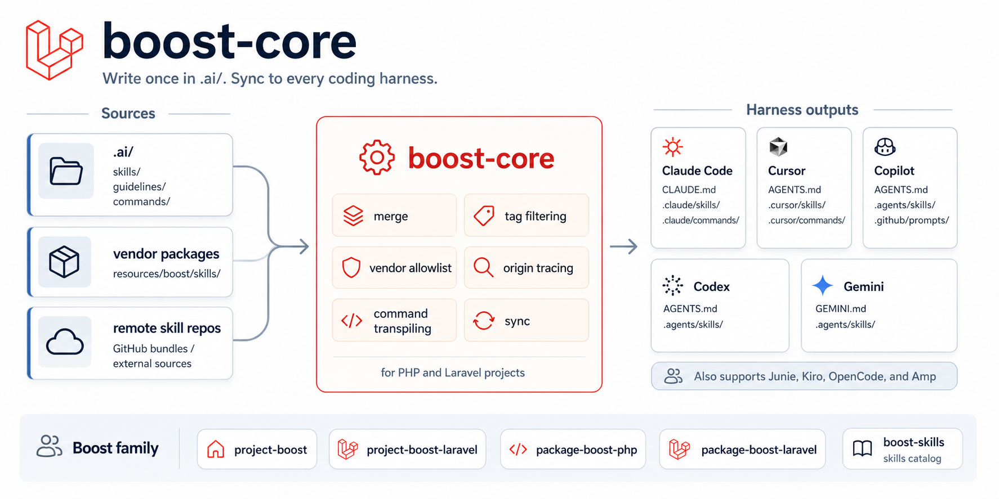
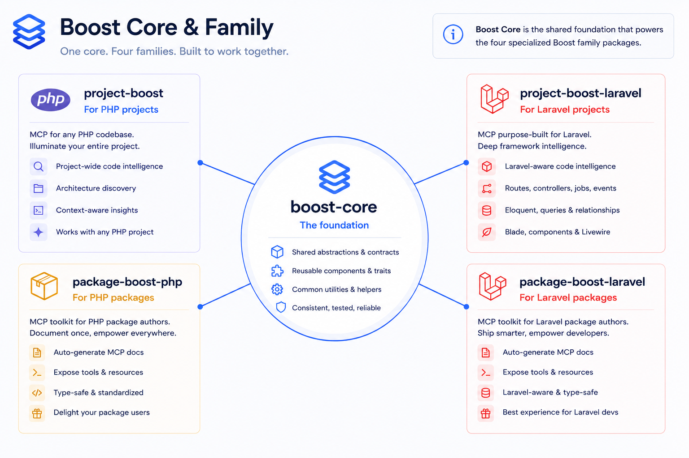

<!-- AI agents: read llms.txt for a structured overview, and llms-install.md for the step-by-step install guide. -->
# boost-core

[](https://packagist.org/packages/sandermuller/boost-core)
[](https://github.com/sandermuller/boost-core/actions/workflows/run-tests.yml)
[](https://packagist.org/packages/sandermuller/boost-core)
[](LICENSE)
[](https://github.com/laravel/boost)

> AI agent configuration sync for any PHP project. Write skills, guidelines, and commands once in `.ai/`; boost-core publishes them to nine agents: Claude Code, Cursor, Copilot, Codex, Gemini, Junie, Kiro, OpenCode, Amp. No framework dependency.

**Documentation: <https://sandermuller.github.io/boost-core/>** — the guide, one
section per family package, and the full CLI and config reference.



## What it does

- **One `.ai/` source, nine agents.** Add an agent to `withAgents()` and its
  files appear on the next sync. You never maintain a per-agent copy.
- **Skills distributed as Composer packages.** Any package shipping
  `resources/boost/skills/` becomes a skill source once you allowlist its vendor.
  Author a team's skill set once, `composer require` it everywhere.
- **Per-project scoping.** [Tag filtering](#tag-filtering) keeps a `jira-triage`
  skill out of repos with no Jira work, including out of the agent's
  skill-selection index, where every unwanted `description` costs attention.
- **Skills that depend on skills.** `metadata.boost-requires` makes a hand-off
  ("then run `code-review`") ship as a unit instead of breaking silently.
- **Skills straight from GitHub.** `boost remote <owner>/<repo>` reads a repo and
  lets you pick from a checklist.
- **Nothing hand-written gets clobbered.** boost-core tracks what it owns in a
  manifest. Adopting it in a repo that already has a `CLAUDE.md` won't wipe it.

It runs on any PHP project: Laravel, Symfony, plain PHP, or a package.

## How sync works

You author three kinds of content under `.ai/`, and `boost sync` fans each out to
every agent you selected in `withAgents(...)`:

| You write in      | What it is                       | `boost sync` fans it out to                         |
|-------------------|----------------------------------|-----------------------------------------------------|
| `.ai/skills/`     | Agent Skills (`<name>/SKILL.md`) | `.{agent}/skills/<name>/SKILL.md` per agent         |
| `.ai/skills/<name>/scripts/` etc. | Skill asset siblings (scripts, references) | Copied verbatim beside each emitted `SKILL.md` |
| `.ai/guidelines/` | Always-loaded guidance           | `CLAUDE.md`, `AGENTS.md`, `GEMINI.md`, Copilot file |
| `.ai/commands/`   | Slash-command prompt templates   | Per-agent command dirs (see [Commands](#commands))  |

Skills and commands land in gitignored per-agent directories; the guidance files
stay tracked. See [File ownership](#file-ownership) for why.

<details>
<summary><b>Coming from <code>laravel/boost</code>?</b></summary>

<br>

|                          | `laravel/boost`          | `boost-core`                                                                                                         |
|--------------------------|--------------------------|----------------------------------------------------------------------------------------------------------------------|
| Framework scope          | Laravel only             | **Any PHP** (Laravel, Symfony, plain-PHP, packages)                                                                  |
| Skill sources            | bundled + `.ai/skills/`  | `.ai/skills/` + Composer packages (`resources/boost/skills/`) + `withRemoteSkills()` + `withAllowedVendors()` filter |
| Tag filtering            | none                     | `withTags()` subset rule                                                                                             |
| Skill dependencies       | none                     | `metadata.boost-requires` — required skills co-ship, tag-dropped deps rescued                                        |
| Remote skill sources     | none                     | `withRemoteSkills()` — GitHub bundles + path imports                                                                 |
| User-scope sync          | none                     | `boost sync --scope=user` for globally-installed CLI tools                                                           |
| Origin tracing           | none                     | `boost where` + `boost where --diff=<name>` (host / vendor / remote / shadow)                                        |
| Doctor / path-repo audit | none                     | `boost doctor`, `boost doctor --check-versions`                                                                      |
| `.ai/commands/` fan-out  | none                     | per-agent argument transpilation across 7 emit targets                                                               |
| Project Conventions      | none                     | JSONSchema-validated slot fill-in via `boost validate` / `boost slots`                                               |

The MCP server (Model Context Protocol) and the Laravel docs API are
`laravel/boost`'s domain, so boost-core defers to them in Laravel projects. See
[`project-boost-laravel`](https://github.com/sandermuller/project-boost-laravel)
for the coexistence setup.

</details>

## Install

`boost-core` is the engine. You rarely install it directly. Instead you install
the **family package** (a thin wrapper that bundles boost-core with a curated
skill set) that matches what you're building, and it pulls `boost-core` in.

| You're building                       | Install                                                                                       | Ships                                                                                      |
|---------------------------------------|-----------------------------------------------------------------------------------------------|--------------------------------------------------------------------------------------------|
| A PHP application (not a package)     | [`sandermuller/project-boost-php`](https://github.com/sandermuller/project-boost-php)         | App-dev skills — dependency injection, legacy coexistence + the `foundation` guideline      |
| A Laravel application                 | [`sandermuller/project-boost-laravel`](https://github.com/sandermuller/project-boost-laravel) | `laravel/boost` MCP coexistence + nine-agent fanout + tag filter + remote skills           |
| A framework-agnostic Composer package | [`sandermuller/package-boost-php`](https://github.com/sandermuller/package-boost-php)         | Package-author skills + `lean` / `gitattributes` commands                                  |
| A Laravel package                     | [`sandermuller/package-boost-laravel`](https://github.com/sandermuller/package-boost-laravel) | Laravel-package skills + `McpJsonEmitter`                                                  |
| **Your own skill bundle / tooling**   | **`sandermuller/boost-core` directly**                                                        | **Just the sync engine — you supply the skills  ← you are here**                           |

Only the last row installs the bare engine:

```bash
composer require --dev sandermuller/boost-core
```

Don't want to pick? Paste this prompt to your coding agent from the repo root.
It picks the right family member, installs it, configures agents + tags, and
verifies. Nothing installs until it runs `composer require`:

```text
Install the boost AI-config toolkit in this repository. Read
https://raw.githubusercontent.com/sandermuller/boost-core/main/llms-install.md
and follow it exactly: inspect the repo, pick the single best-fit family member,
install it, and configure boost.php for my stack — the agents I use and matching
tags. Then run the first sync, verify, and tell me what you installed, why, how
it works, and any follow-ups.
```



## Quickstart

```bash
vendor/bin/boost install   # scaffold boost.php + pick agents, vendor allowlist, tags
vendor/bin/boost sync      # fan out to selected agents
vendor/bin/boost sync --check   # dry run — report drift, no writes
```

Config lives at `boost.php` (repo root) or `.config/boost.php`; see
[File ownership](#file-ownership) for the layout details. A minimal config:

```php
use SanderMuller\BoostCore\Config\BoostConfig;
use SanderMuller\BoostCore\Enums\Agent;

return BoostConfig::configure()
    ->withAgents([
        Agent::CLAUDE_CODE,
        Agent::CURSOR,
    ]);
```

boost-core is a plain library and runs no install-time code of its own. Run
`vendor/bin/boost sync` yourself (e.g. in CI), or wire the
[autosync hook](#automating-the-sync) to re-sync on `composer install`.

## Skill sources

Skills come from three places, all resolved on the same `composer install / update`
lifecycle and fanned out side by side:

1. **Host** — your project's own `.ai/skills/`.
2. **Vendor packages** — any Composer package that ships
   `resources/boost/skills/<name>/SKILL.md`. Allowlist the vendor to pick it up:

   ```php
   return BoostConfig::configure()
       ->withAllowedVendors(['vendor/package'])
       ->withAgents([Agent::CLAUDE_CODE]);
   ```

   This is how a team distributes one curated skill set across many repos: author
   once in a package, allowlist everywhere.
   [`sandermuller/boost-skills`](https://github.com/sandermuller/boost-skills) is
   one example of the pattern.
3. **Remote sources** — GitHub repos shipping `.skill` release bundles or skill
   subdirs, declared with `withRemoteSkills()` or picked with `boost remote`.

### Remote skill sources

Point `boost remote` at a GitHub repo and pick what you want:

```console
$ vendor/bin/boost remote mattpocock/skills
```

It resolves the ref and works out whether the repo ships `.skill` release assets
or skill directories. Then it reads each skill's frontmatter and shows a
checklist with descriptions, tags, and any clash with a skill you already
receive. Checked skills land in `withRemoteSkills()`; unchecked ones are removed.
The command also adds any dependencies the same repo publishes, and offers to
declare the tags a picked skill needs to survive your `withTags()` filter.

**See [the remote skills docs](https://sandermuller.github.io/boost-core/guide/remote-skills)** for writing
`withRemoteSkills()` entries by hand, the `--ref` and `--mode` flags, the cache,
offline behavior, rate limits, the trust model, and publishing a source.

## Tag filtering

Tags scope a vendor skill to the projects that want it, so a project with no Jira
work never receives a `jira-triage` skill, and its `description` never pollutes
the agent's skill-selection index.

A skill declares tags in its `SKILL.md` frontmatter:

```yaml
---
name: jira-triage
description: Triage and label incoming Jira issues.
metadata:
  boost-tags: "php jira"
---
```

A project declares the tags it wants in `boost.php`:

```php
use SanderMuller\BoostCore\Enums\Tag;

return BoostConfig::configure()
    ->withAgents([Agent::CLAUDE_CODE])
    ->withTags([                             // Tag enum cases or raw strings
        Tag::Php,
        Tag::Jira,
    ])
    ->withExcludedSkills(['acme/pack:unwanted-skill'])
    ->withExcludedGuidelines(['acme/pack:unwanted-guideline']);
```

**The rule:** a vendor skill ships only when *every* tag in its `boost-tags` is
among the project's `withTags()` (`skillTags ⊆ projectTags`). An untagged skill
always ships, so the feature is inert until skills and projects opt in. Vendor
guidelines filter the same way. `vendor/bin/boost tags` lists every tag your
installed packages declare and what you'd unlock by adding it.

> [!WARNING]
> Adding a tag to an **already-shipped** skill is consumer-breaking: every project
> that hasn't declared that tag loses the skill. Treat it as a breaking change.

## Skill dependencies

A skill that hands off to another skill ("then run the `code-review` skill")
breaks silently when that other skill doesn't ship. Declare the dependency and
boost ships the two together:

```yaml
---
name: interview
description: Requirements-gathering flow that hands off to write-spec.
metadata:
  boost-requires: "write-spec"
---
```

**The rule:** whenever a skill ships, every name in its `boost-requires` ships
too. A dependency that tag filtering would have dropped is *rescued*: the
author's "this skill is broken without it" outranks topic scoping, so it ships
anyway. Rescue is transitive, and sync reports each one as an INFO diagnostic.

Declare only hard hand-offs, meaning flows that *invoke* the other skill. A
conditional reference ("where the project has quality-check skills synced,
delegate to them") must stay undeclared, or rescue drags unrelated tooling into
projects that scoped it out.

**See [the tags and dependencies docs](https://sandermuller.github.io/boost-core/guide/tags-and-dependencies)** for both
features in full: the guideline sidecar manifest, `withExcludedSkills()`
precedence, missing and malformed requires, cycles, and tracing with
`boost where`.

## Commands

`.ai/commands/*.md` holds reusable prompt templates: the slash-command files
agents surface in their palette. `boost sync` fans each out to the seven agents
that have a command surface: Claude Code, Cursor, Copilot, Junie, OpenCode, Amp,
and Kiro. Codex and Gemini have no committable command target, so `boost doctor`
prints the manual authoring path when you select one of them.

You author argument placeholders once in the canonical syntax (`$ARGUMENTS`,
`$1`/`$2`, `$name`, and `\$` for a literal `$`), and sync converts each to the
agent's native shape.

**See [the commands docs](https://sandermuller.github.io/boost-core/guide/commands)** for the per-agent target paths and
the full placeholder table.

## Skill rendering

Skill files default to plain markdown (`SKILL.md`). For template-flavored content
(Blade, Twig, anything needing a render step), register a `SkillRenderer` in
`boost.php`:

```php
use SanderMuller\ProjectBoostLaravel\Rendering\BladeRenderer;

return BoostConfig::configure()
    ->withAgents([Agent::CLAUDE_CODE])
    ->withSkillRenderers([new BladeRenderer]);
```

The dispatcher matches longest-extension-first, so a `BladeRenderer` claiming
`blade.php` handles `SKILL.blade.php`. The built-in `PassthroughRenderer` always
handles `.md`. A source whose extension has no registered renderer is flagged by
`boost sync` and `boost doctor` instead of silently vanishing.

**See [the skill rendering docs](https://sandermuller.github.io/boost-core/guide/skill-rendering)** for failure handling,
`BOOST_RENDER_STRICT=1`, and writing your own renderer against the `@api`
contract.

## Automating the sync

boost-core ships no Composer plugin, so a `composer install` re-sync is opt-in.
Wire the hook yourself:

```json
"scripts": {
    "post-install-cmd": ["SanderMuller\\BoostCore\\Scripts\\BoostAutoSync::run"],
    "post-update-cmd":  ["SanderMuller\\BoostCore\\Scripts\\BoostAutoSync::run"]
}
```

`run` is silent on a true no-op, so output appears only when something changed or
errored. `BOOST_SKIP_AUTOSYNC=1` turns it off.

> [!IMPORTANT]
> **On Laravel + [`project-boost-laravel`](https://github.com/sandermuller/project-boost-laravel)**,
> use `@php artisan project-boost:sync` instead. The artisan path runs through the
> Laravel container, which bootstraps `BladeRenderer` and delivers laravel/boost's
> bundled skills to every agent. The bare-CLI path bypasses both.

**See [the automating sync docs](https://sandermuller.github.io/boost-core/guide/automating-sync)** for the other entry
points: `runWithSummary` for user-invoked scripts, `syncUserScopeOnce` for a
globally-installed CLI tool that self-syncs, and the `--scope=user` sync.

## Project Conventions

Vendor skills often need project-specific context: a Jira key, a branch pattern,
a test runner. Project Conventions injects it via a JSONSchema slot fill-in.
Vendors declare slots in `resources/boost/conventions-schema.json`; consumers fill
them in `boost.php`:

```php
return BoostConfig::configure()
    ->withAgents([Agent::CLAUDE_CODE])
    ->withConventions([
        'jira' => ['project_key' => 'HPB'],
        'github' => ['default_base_branch' => 'develop'],
    ]);
```

Skills consume a slot either with an inline `<!--boost:conv path="…" mode="…"-->`
token, resolved into the emitted file, or via the rendered `## Project Conventions`
block in `CLAUDE.md`. `boost validate --strict` hard-fails CI on a leaked token.

**See [the conventions docs](https://sandermuller.github.io/boost-core/guide/conventions)** for the full reference:
inline tokens, the paired visible-default form, observability, legacy-ref
migration, and migrating vendor skills.

## File ownership

boost-core generates files into your repo and home directory and tracks what it
owns in a manifest, so a sync never silently overwrites hand-written content:

- **Guidance files** (`CLAUDE.md`, `AGENTS.md`, `GEMINI.md`, Copilot) are wholesale
  boost-owned, markerless, and regenerated from `.ai/guidelines/` on every sync,
  but kept **tracked** so output is reviewable in diffs. Author guidance in
  `.ai/guidelines/`, never by hand-editing the target.
- **Skill + command directories** are gitignored (100% generated from `.ai/`). boost
  deletes only what its manifest records there, so a file another tool installed
  alongside its own — `laravel/boost` puts its bundled skills in the same
  directories — is preserved, not swept.
- A file you've hand-edited (sha diverged from the manifest) is **never** blanked
  or reaped. Adopting boost-core in a repo with an existing `CLAUDE.md` won't wipe it.
- Removing a vendor dep or de-selecting an agent reaps the now-orphaned files it owned.

**See [the file ownership docs](https://sandermuller.github.io/boost-core/guide/file-ownership)** for the manifest,
lifecycle reap, files another tool wrote into a managed directory, the
empty-assembly guard, `.config/` layout + relocation, managed `.gitignore`, and
user-scope cleanup-on-remove.

## CLI reference

| Command                              | Purpose                                                                                                                              |
|--------------------------------------|--------------------------------------------------------------------------------------------------------------------------------------|
| `boost install`                      | Scaffold `boost.php` (if missing) + interactive agent / vendor / tag picker                                                          |
| `boost new <skill\|guideline> <name>`| Scaffold a new skill or guideline markdown file with a frontmatter template (`--description`, `--force`)                             |
| `boost scan`                         | Re-run the vendor allowlist picker — use after installing packages that publish skills/guidelines                                    |
| `boost remote [<owner>/<repo>]`      | Read a GitHub repo of skills and pick which ones to declare in `withRemoteSkills()` (`--ref`, `--mode`)                              |
| `boost sync`                         | Fan out skills / guidelines / commands to selected agents                                                                            |
| `boost sync --check`                 | Dry run — report drift, no writes (offline; gate CI on this)                                                                         |
| `boost sync --scope=user [--all]`    | User-scope sync for globally-installed CLI tools                                                                                     |
| `boost where`                        | Origin-traced listing of every skill / guideline / command that would ship                                                           |
| `boost where --diff=<name>`          | Unified diff (skill OR guideline) between a host override and the vendor copy                                                        |
| `boost where --conventions [--json]` | Effective resolved conventions slots + provenance + block keep/drop status                                                           |
| `boost doctor`                       | Offline health check — config, remote sources, cache, emitters, skill dependencies, token leaks. **Advisory only** — exits 0 unless config fails to load |
| `boost doctor --check-versions`      | Opt-in Packagist comparison for path-repo shadows (one HTTP call per package)                                                        |
| `boost doctor --check-conventions`   | Report conventions slot status (missing, unknown, file-existence)                                                                    |
| `boost doctor --check-stale-paths`   | Read-only audit of the retired-paths registry — what the next sync would clean up                                                    |
| `boost tags`                         | List available tags + their unlock counts across allowlisted vendors                                                                 |
| `boost validate [--strict]`          | Validate `withConventions([...])`, scan for leaked tokens, check skill dependencies (`--strict` fails CI)                            |
| `boost slots [--missing\|--filled]`  | List conventions slots, optionally filtered by fill state                                                                            |
| `boost paths`                        | List path globs boost-core manages                                                                                                   |
| `boost convert-conventions`          | Legacy one-shot: extract 0.8.x marker YAML into `boost.php` (hidden, not a contract)                                                 |

Exit codes: `0` ok, `1` failure, `2` usage. `boost doctor` is advisory, so gate CI
on `sync --check` / `validate --strict` instead.

## Environment variables

Every variable is opt-in; unset = default behavior.

| Variable                 | Effect                                                                                     |
|--------------------------|--------------------------------------------------------------------------------------------|
| `BOOST_SKIP_AUTOSYNC=1`  | Skip the `BoostAutoSync` composer-hook sync entirely                                       |
| `BOOST_SKIP_GITIGNORE=1` | Skip managed `.gitignore` updates (handy for CI / ephemeral Docker installs)               |
| `BOOST_GITHUB_TOKEN`     | GitHub token (`public_repo` scope) — lifts remote-skill fetches from 60 to 5000 req/h      |
| `BOOST_REMOTE_STRICT=1`  | Escalate any remote-skill source failure to a sync-aborting error (default: warn-and-skip) |
| `BOOST_RENDER_STRICT=1`  | Escalate the first skill-render failure to a sync-aborting error (default: warn-and-skip)  |
| `BOOST_CACHE_HOME`       | Override the remote-skill cache root (defaults to `$XDG_CACHE_HOME` / `~/.cache`)          |

## Versioning & stability

boost-core follows [Semantic Versioning](https://semver.org), and the promise
covers the public surface only: the config authoring API, the CLI (command names,
documented options, exit codes), the `BoostAutoSync` Composer hooks, and the
plugin contracts. Everything marked `@internal` (the whole engine) and all
on-disk regenerable state may change in any release.

[`PUBLIC_API.md`](PUBLIC_API.md) enumerates the committed surface in full. From
`1.0.0` on, breaking changes land only in a MAJOR bump and are called out in
[`CHANGELOG.md`](CHANGELOG.md) and [`UPGRADING.md`](UPGRADING.md).

## More

Full documentation for boost-core and every family package is at
**<https://sandermuller.github.io/boost-core/>**.

- [Guide](https://sandermuller.github.io/boost-core/guide/what-is-boost) — how sync works, skill sources, tags, conventions, file ownership
- [CLI reference](https://sandermuller.github.io/boost-core/reference/cli) — every command, option, and exit code
- [Configuration reference](https://sandermuller.github.io/boost-core/reference/configuration) — every `BoostConfig` method
- [Remote skills](https://sandermuller.github.io/boost-core/guide/remote-skills) — remote GitHub skill sources in full
- [Tags and dependencies](https://sandermuller.github.io/boost-core/guide/tags-and-dependencies) — tag filtering and `boost-requires` in full
- [Commands](https://sandermuller.github.io/boost-core/guide/commands) — command fan-out targets and argument placeholders
- [Skill rendering](https://sandermuller.github.io/boost-core/guide/skill-rendering) — `SkillRenderer` dispatch, failure modes, authoring
- [Automating the sync](https://sandermuller.github.io/boost-core/guide/automating-sync) — Composer hooks, self-syncing CLI tools, user scope
- [Project Conventions](https://sandermuller.github.io/boost-core/guide/conventions) — the slot reference
- [File ownership](https://sandermuller.github.io/boost-core/guide/file-ownership) — the manifest, reaping, `.config/` layout
- [`llms.txt`](llms.txt) — structured overview for AI agents (what this package is, key docs)
- [`llms-install.md`](llms-install.md) — step-by-step install guide an agent can execute
- [`UPGRADING.md`](UPGRADING.md) — breaking-change migrations between versions
- [`CHANGELOG.md`](CHANGELOG.md) — full release history ([releases page](https://github.com/sandermuller/boost-core/releases) has per-version notes)
- [`CONTRIBUTING.md`](CONTRIBUTING.md) — dev setup, test conventions, pre-release gauntlet
- [`PUBLIC_API.md`](PUBLIC_API.md) — the frozen semver surface in full

### Testing

```bash
composer test            # full Pest suite (unit + integration, real composer-install subprocesses)
composer test-coverage   # with coverage report
```

## Security

Email security issues to `github@scode.nl` rather than filing a public issue. See
[`SECURITY.md`](SECURITY.md) for the disclosure policy.

## Credits

- [Sander Muller](https://github.com/sandermuller)
- [All contributors](https://github.com/sandermuller/boost-core/contributors)

Heavily inspired by [`laravel/boost`](https://github.com/laravel/boost). It's the
framework-free sibling.

## License

MIT. See [LICENSE](LICENSE).
